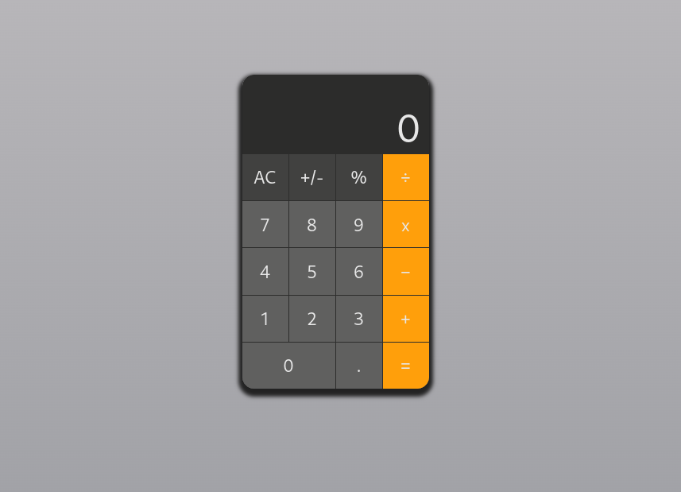
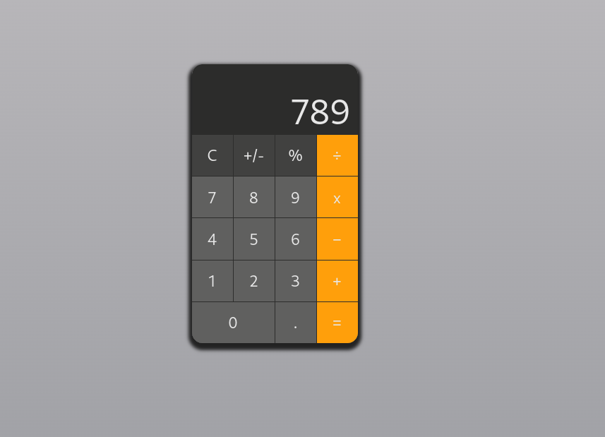

# Calculater App

A very simple **_Calculater App_** which you can solve your Mathematical questions and daily taks with it :)





## Launguages and Tools are used

1. **Launguages**
    + [HTML](https://github.com/topics/html)
    + [CSS](https://github.com/topics/css)
    + [React](https://github.com/topics/react)
    + [JavaScript](https://github.com/topics/javascript)

2. **Tools** 


## Before you Begin 🛠 🔨

```
$ npm install
$ npm run dev
```

```
$ pnpm install
$ pnpm run dev
```

Head over to https://vitejs.dev/ to learn more about using vite

## For cloning the project 🪛

```
# Clone this repository
$ gh repo clone MastooraTurkmen/React-Project

# Go inside the repository
$ cd react-project
```

------

# React + Vite

This template provides a minimal setup to get React working in Vite with HMR and some ESLint rules.

Currently, two official plugins are available:

- [@vitejs/plugin-react](https://github.com/vitejs/vite-plugin-react/blob/main/packages/plugin-react/README.md) uses [Babel](https://babeljs.io/) for Fast Refresh
- [@vitejs/plugin-react-swc](https://github.com/vitejs/vite-plugin-react-swc) uses [SWC](https://swc.rs/) for Fast Refresh

------


## Author 👩🏻‍💻 

**Mastoora Turkmen**  
[LinkedIn](https://www.linkedin.com/in/mastoora-turkmen/) 
[Github](https://github.com/MastooraTurkmen/) 
[Twitter](https://twitter.com/MastooraJ22)