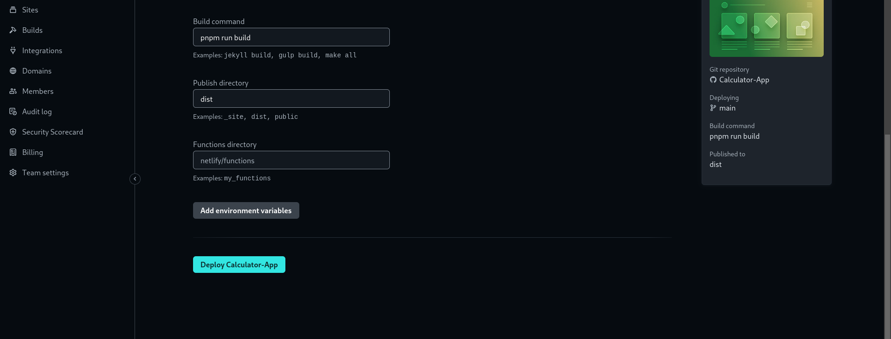
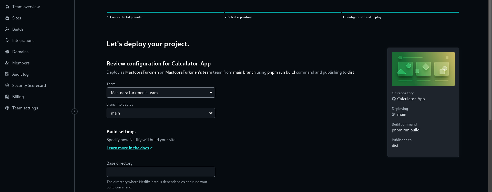

# Calculater App

A very simple **_Calculater App_** which you can solve your Mathematical questions and daily tasks with :)

https://a-simple-calculator-site.netlify.app/


## Languages and Tools are used

1. **Languages**
    + [HTML](https://github.com/topics/html)
    + [CSS](https://github.com/topics/css)
    + [React](https://github.com/topics/react)
    + [JavaScript](https://github.com/topics/javascript)

2. **Tools** 
    + [Chrome](https://github.com/topics/chrome)
    + [VSCode](https://github.com/topics/vscode)
    + [Figma](https://github.com/topics/figma)
    + [Netlify](https://github.com/topics/netlify)


## Before you Begin 🛠 🔨

```
$ npm install
$ npm run dev
```

```
$ pnpm install
$ pnpm run dev
```

Head over to https://vitejs.dev/ to learn more about using vite

## For cloning the project 🪛

```
# Clone this repository
$ gh repo clone MastooraTurkmen/Calculator-App

# Go inside the repository
$ cd calculator-app
```

------


## Deployment📥

1. How to deploy our project to the Netlify site?
2. I use [Netlify App](https://app.netlify.com/) for deploying my projects.
3. Go to the Netlify site and select Add a new site.
4. From there select **_Deploy with Github_**.
5. Then write your project name and select it.
6. After selecting here you can see that the project **_Review configuration for Calculator-App_** and then select the **_Deploy Calculator-App_** Button.
  + 
  + 
7. Now your project is Live.

# React + Vite

This template provides a minimal setup to get React working in Vite with HMR and some ESLint rules.

Currently, two official plugins are available:

- [@vitejs/plugin-react](https://github.com/vitejs/vite-plugin-react/blob/main/packages/plugin-react/README.md) uses [Babel](https://babeljs.io/) for Fast Refresh
- [@vitejs/plugin-react-swc](https://github.com/vitejs/vite-plugin-react-swc) uses [SWC](https://swc.rs/) for Fast Refresh

------


## Author 👩🏻‍💻 

**Mastoora Turkmen**  
[LinkedIn](https://www.linkedin.com/in/mastoora-turkmen/) 
[Github](https://github.com/MastooraTurkmen/) 
[Twitter](https://twitter.com/MastooraJ22)
